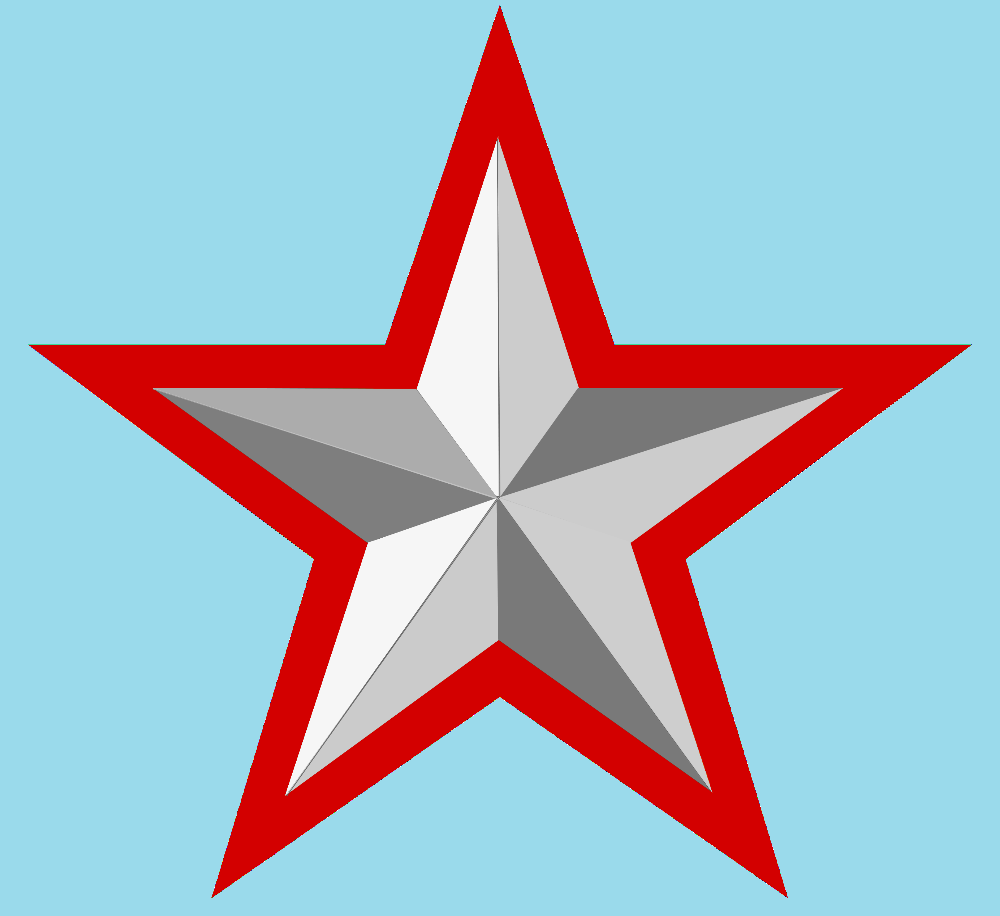

# alphablender
Alpha Blending packege for go

## very simple function to join two images togather
Function uses Alpha Blend for calculating pixels.
https://en.wikipedia.org/wiki/Alpha_compositing

## Install
```
go get github.com/chixm/alphablender
```

## How to use
- Blend

just set blending image to first arg, background image to second arg.

```go
blendedImage := alphablender.Blend(starImage, backImage)
```

- `src` (1st arg): the image to blend on top, e.g. `starImage`
- `dst` (2nd arg): the background image, e.g. `backImage`
- returns `*image.RGBA`, sized to `dst`'s bounds

starImage and backImage variable is image.Image type of Go.
Both images must be either `*image.RGBA` or `*image.NRGBA` (a plain `png.Decode` result satisfies this for typical PNGs).

### Full example: blend two PNG files and save the result

```go
package main

import (
	"image/png"
	"os"

	"github.com/chixm/alphablender"
)

func main() {
	back, err := os.Open("./background.png")
	if err != nil {
		panic(err)
	}
	defer back.Close()

	star, err := os.Open("./star.png")
	if err != nil {
		panic(err)
	}
	defer star.Close()

	backImage, err := png.Decode(back)
	if err != nil {
		panic(err)
	}
	starImage, err := png.Decode(star)
	if err != nil {
		panic(err)
	}

	blendedImage := alphablender.Blend(starImage, backImage)

	out, err := os.Create("createdImage.png")
	if err != nil {
		panic(err)
	}
	defer out.Close()

	png.Encode(out, blendedImage)
}
```

see blend_test.go , describes how to blend two png file images togather.

### Blending images of different sizes

`src` and `dst` no longer need to be the same size. The output canvas always
matches `dst` (the background). `src` is aligned to `dst`'s top-left corner:
- if `src` is smaller than `dst`, the area outside `src` is left as `dst`'s
  original pixels (as if `src` were fully transparent there).
- if `src` is larger than `dst`, the extra area of `src` is cropped off.

```go
// backImage is 4x4, starImage is 2x2 - both are fine
blendedImage := alphablender.Blend(starImage, backImage)
// blendedImage.Bounds() == backImage.Bounds()
```

You can blend two images togather

<nobr>

+

=

</nobr>

# Limitation
- images must be RGBA or NRGBA type.
- if src and dst are different sizes, the output is sized to dst (the background); src is aligned to dst's origin and cropped or padded with transparency as needed.

# Support
If this package helped you, consider buying me a coffee:

[](https://ko-fi.com/chixm2019)

